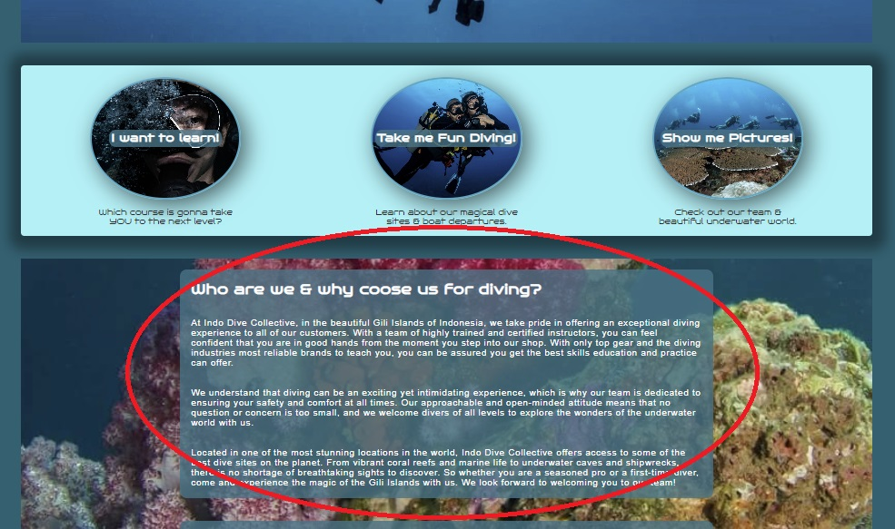

# **Indo Diving Collective**

Welcome to the Indo Diving Collective, a dive shop website created out of our love for diving and desire to share it with others. The purpose is to provide a responsive and user-friendly experience that welcomes and intrigues users to visit the dive shop in the Gili Islands in Indonesia. Planning a dive trip can be overwhelming, so the website is designed with the user in mind to make the process as easy and enjoyable as possible. The site is easy to navigate and the design visually engaging to make sure it invites customers to explore the content and learn more about the dive shop and what it offers.

*Please have a look at the deployed website *

&nbsp;

## **CONTENT**

## Table of Content

1. [Project Goals](#project-goals)
    1. [User Goals](#user-goals)
    2. [Returning Visitor Goals](#returning-visitor-goals)
    3. [Site Owner Goals](#site-owner-goals)
    4. [Developer Goals](#developer-goals)
2. [User Experience](#user-experience)
    1. [User Stories](#user-stories)
3. [Design](#design)
    1. [Colour](#colours)
    2. [Fonts](#fonts)
    3. [Structure](#structure)
    4. [Wireframes](#wireframes)
4.  [Features](#features)
5. [Technologies Used](#technologies-used)
    1. [Languages](#languages)
    2. [Frameworks & Tools](#frameworks-&-tools)
6. [Testing](#validation)
    1. [HTML Validation](#HTML-validation)
    2. [CSS Validation](#CSS-validation)
    3. [Accessibility](#accessibility)
    4. [Performance](#performance)
    5. [Device testing](#performing-tests-on-various-devices)
    6. [Browser compatibility](#browser-compatability)
    7. [Testing user stories](#testing-user-stories)
8. [Bugs](#Bugs)
9. [Deployment](#deployment)
10. [Credits](#credits)
11. [Acknowledgements](#acknowledgements)

&nbsp;

## **GOALS**
### **Project Goals**
The primary goal of this project is to create a visually appealing, responsive website that promotes the dive shop and encourages users to visit the at the shop or to contact them with any questions or request for booking via a easily found contact form. The website is designed to ensure that access to a returning user's main objectives (booking courses or fun dives and to see boat departure schedule) is user-friendly and efficient. The website should also reflect the dive shop's overall openminded tone, providing a welcoming experience for potential customers.

### **User Goals**

- A well-designed and easy-to-use website that is visually appealing and responsive on all devices.
- Clear and concise information about the dive shop's services, prices, and location.
- Easy access to contact the dive shop for more information or to book courses or fun dives.
- Easy acsess to links to the dive shops social media links in the fixed footer. 
- Call-to-action buttons and links that allow for easy booking through contact form.
- Visual display of the dive shop's offerings, including high-quality photos tastefully on every page.
- Sufficient information about the dive shop and its services to make the customer feel safe and encouraged to contact them.

### **Returning Visitor Goals**

- Quick and easy access to the course selection that is offered.
- Clear and concise information about any updates or changes to the dive shop's services, prices or changed boat 
departures.
- Easy access to contact the dive shop for support or additional information.
- Easy acsess to links to the dive shops social media links in the fixed footer.

### **Site Owner Goals**

- Promote the dive shop's services and brand.
- Increase the number of paying customers and bookings.
- Provide easy-to-find contact form plus alternative ways for all customers to easily contact the dive shop.
- Provide a user-friendly website experience to encourage booking.
- Provide all neccessary information about the dive shop's services, prices, and location.

### **Developer Goals**

- Create a clean and visually appealing design that reflects the dive shop's brand.
- Develop a responsive website that works effectively on all devices.
- Create an easy-to-use website with clear navigation and pathways to specific pages.
- Develop a project that meets the dive shop's needs and exceeds expectations.

&nbsp;

## **USER EXPERIENCE**

The Indo Diving Collective website was designed with the user experience in mind. Our website caters to a broad range of individuals aged 16 and above who are interested in diving, regardless of their experience level. We want our website to provide a simple and user-friendly navigation system that allows our visitors to find relevant information quickly and efficiently. We also aim to provide a visually appealing design that works well on all screen sizes since our customers are believed to be both desktop and mobile users that could possibly plan a dive trip from their home office or be backpackning through Asia relying solely on ther mobile device. Links and functions is expected to function properly and it's important for us to have an easy way for potential customers to contact us. Therefore the content on the site is to be easily readable and last but not least we want our website to be accessible for all users, regardless of their abilities.

&nbsp;
### **USER STORIES**
#### **First time users**
1. _As a first-time user, I want to learn more about the dive shop, feel a good first impression and a welcoming attitude._
2. _As a first-time user, I want to easily find information about the location of the dive shop._
3. _As a first-time user, I want to easily contact the dive shop if I have any questions or want to make a reservation._
4. _As a first-time user, I want to know the prices for scuba diving courses and fun diving._
5. _As a first-time user, I want to know the schedule for boat departures._
6. _As a first-time user, I want to learn about the different scuba diving courses and dive sites._
7. _As a first-time user, I want to see dynamic photos that showcase the dive shop's staff and the beauty of the dive sites.
#### **Returning users**
8. _As a returning user, I want to quickly access the dive shop's boat departure schedule._
9. _As a returning user, I want to find different ways to contact the dive shop depending on my preferences._
10. _As a returning user, I want to easily make contact to book a course or fun diving trip with fast and helpful staff._
11. _As a returning user, I want to follow the dive shop on social media to stay up-to-date on news, events and changed schedules._
12. _As a returning user, I want to get directions to the dive shop._
13. _As a returning user, I want to refresh my memory about the different scuba diving courses and dive sites._
#### **Site owner**
14. _As the site owner, I want users to easily contact us in their prefered way to get a fast and helpful respons without waiting too long._
15. _As the site owner, I want users to get a great impression of the dive shop's services and the beauty of the surrounding area._
16. _As the site owner, I want users to easily be able to book scuba diving trips and courses through the website._
17. _As the site owner, I want users to have a custom made 404 error message with the websites familiar design to direct them back to the website when needed._

&nbsp;

## **FEATURES**

The website has four responsive pages, althoug the "Home" page consists of five sections that corresponds to approximatley 3-4 pages. By using correct HTML markup and labels it is ensured screen readers can accurately interpret the pages.

&nbsp;

### **HEADER & NAVIGATION BAR**

- Users can access all pages in the fixed header navigation bar to the right. In that way the user never needs to scroll up to find the links the need or the page to have a "go back up" button. 
- It also contains a fifth link - "Contact Us" - that takes the user to the contact form that's further down on the "Home"-page.
- Navigation links have a hover effect with a border underline in a sharp contract color for the users to see ut's clickable. The same border underline is there static on the page the user is actively on, so it's easy to see exactly what page is visited. 
- In the left corner we have the dive shop logo which is also made a link to the "Home" page as most users would expect that from standards. 
- It's fully responsive from wide desktop screens down to small sized mobile screens to meet all users expectations. The navigation links is therefore presented centered under the logo on mobile devices to fit nicely.
- User stories covered: 3, 6, 7, 9, 11, 12, 14

 (Responsive design for mobile devices)

&nbsp;

### **LANDING PAGE / HERO IMAGE**

- The user is introduced to this vivid and dynamic hero image, taking up much of the screen, which is made with a few seconds of slow, smooth zoom effect to get the feel that the happy diver is coming a little bit closer. 
- The image sends a positive vibe and also gives the user an adventurous slogan "Are you ready to explore the underwater world?" in text overlay of coral red/pink contrast color the get them intrigued. 
- Below the hero image we see that the page continues, which lets the user know for sure that they can scroll down. 
- User stories covered: 7, 15

&nbsp;

### **BANNER SECTION followed by ABOUT US**

The banner contains:
- Inside the light blue banner there's three clickable links with round image backgrounds that speak directly to the user's needs and desires.
- The links represent the user's potential next steps when visiting the page. They are labeled "I want to learn", "Take me fun diving!" and "Show me pictures" and under them there's a paragraph stating what they will find once clicked.
- Each link corresponds to a link in the navigation bar that reflects the user's selected need.
- The banner links are ordered in the same sequence as they appear in the navigation bar after "Home".
- The links have a hoover effect that looks like the text gets pushed back, so the user sees it's clickable.
- The section is fully responsive for smaller screen sizes and becomes a litte more compressed but has the same design.
- Below the banner we immediateley see the "About Us" section letting the user get to know the dive shop a little more. 
- User stories covered: 1, 4, 6, 8, 13

 (Responsive design for mobile devices)
 (Responsive design for mobile devices)

&nbsp;

### **CONTACT FORM**

- The contact form can be accessed from any "Contact Us" link on the website.
- It is placed directly below the "About Us" section so users see it when they scroll down.
- It asks for the usual user information (name, email, phone number), but also if the user is certified and how many dives they have completed.
- By asking these questions upfront, the user's certification level and experience are already stated before they are asked to write a message with any requests or questions they might have.
- The placeholder text in the text area asks the user to drop them a message and to have a nice day. This makes the user feel welcome to submit their request.
- The form is designed to be simple and intuitive, with clear labels and a visually appealing design.
- The form features a submit button with a hover effect to enhance the user experience.
- It is fully responsive, ensuring a smooth user experience on all screen sizes.
- With accessibility in mind, using correct HTML markup and labels to ensure screen readers can accurately interpret the form. Additionally, the active window changes color to provide a clear indication of where the user is in the form.
- User stories covered: 3, 10, 14

&nbsp;

### **OPENING HOURS & HOW TO FIND US**

- Structured tables for easy readability and information accessibility
- Google map embedded in the bottom to provide a visual representation of the shop's location
- User stories covered: 2, 9, 12, 14, 16

&nbsp;

### **COURSES**

- Provides information about the available courses, including their names a short description and the price for each of them. The price has a USD icon slightly bigger beside it to give an overall more appealing look to relatively high prices.
- A clear and prominent "Contact Us Today" button with the coral pink/red used throughout the website. It's located at the bottom of the page, inviting users to get in touch if they have any questions or want to book a course.
- Clicking the "Contact Us Today" button takes the user directly to the contact form.
- User stories covered: 4, 6, 10, 13, 16

&nbsp;

### **DIVE SITES**

- Provides brief information about the three major dive sites.
- In the bottom the page displays the schedule for boat departures along with the prices for different packages for fun diving.
- The same clickable contact button as on "Courses" page invites the users to get in touch if they have any questions or want to book a fun dives.
- User stories covered: 4, 6, 10, 13, 16

&nbsp;

### **GALLERY**

- Simple and visually appealing page that showcases a variety of colorful and amazing pictures taken by the dive shop.
- The page is fully responsive and adjusts from 3 rows to one row depending on the user's screen size, making it easy to view and browse through the images on any device.
- The page is designed to be simple allowing users to focus on the stunning images without any distractions.
- User stories covered: 7, 15

 (Responsive design for mobile devices)

&nbsp;

### **FOOTER**

- The footer is fixed on every page and contains the social media links. It's important these links are easily accessed because the site states that the user should check the dive shops social media pages for more news and updates about changes in schedules. 
- User stories covered: 1, 7, 11, 15

&nbsp;

### **404 - PAGE NOT FOUND ERROR MESSAGE**

A custom-made 404 error page was made since it is a simple yet effective way to improve the user experience on your website and keep users happy even if an error page occurs. It has the header, footer and colors from the original design. A dive mask image with a little fun text underneath helps the user back to the "Home" page. 
- User stories covered: 17

&nbsp;

## **DESIGN**

### **Colors**
- Color scheme inspiration was taken from the various shades of green and blue found in the ocean. These colors are not only the developer's favorites but also have a calming effect that was desired to convey to the visitors. 
- A complementary color was added for sharp contrast. Color was taken from the pink corals featured in the background image of the "Home" page. This color is used throughout the page to create a sense of continuity, but with varying opacity depending on where it is used. White was chosen for all text to create a clear contrast against the darker turquoise background as it's the main color of the site. 
- These design choices was thought to help create a visually appealing and cohesive website that will leave a positive impression on our visitors.

### **Fonts**

- Logo /h1: Bruno Ace SC (capital letters)
- Rest of the headings: Bruno Ace (lower case letters)
- Font set to the body of the page (and therefore also as a fallback font to the headings): Arial, Helvetica, sans-serif.

The font used for headings had a design to it that really felt like it could fit this dive shop. 

### **Structure**
The site has been designed with a user-friendly and intuitive structure. Upon arrival, the user is greeted with a navigation bar that features the logo on the left and links to different sections of the website on the right.

The website is composed of four distinct pages:

- The homepage, which features sections information about the shop, contact form, opening hours, contact information and a map of location.
- An Courses page, which provides information about the courses the dive shop teaches. 
- The Dive Sites page, which showcases the different dive sites, what it costs and boat departures.
- A Gallery page, which features images that provide a glimpse of the experience of diving there.

By organizing the content into distinct pages, the website makes it easy for users to navigate and find the information they are looking for. Additionally, the use of a consistent navigation bar and footer throughout the website ensures that users can always find their way back to the main sections of the website and find the social media links.

### **Wireframes**

Home

Courses

Dive Sites

Gallery

&nbsp;

## **Technologies Used**

### **Languages**
- HTML
- CSS

### **Frameworks & Tools**
- Git
- GitHub
- Gitpod
- Tinypng
- Paint (for Windows)
- Balsamiq
- Google Fonts
- Adobe Photo Shop
- Font Awsome
- Favicon.io 
- W3C validator
- Jigsaw CSS validator
- WAVE Web Accessibility Evaluation Tool

&nbsp;

## **Testing**

### **HTML Validation**

The W3C Markup Validation Service was used to validate the HTML of the website. All pages pass with no errors except index-page. It states a contrast error of the Google-map at the bottom of the page.

index.html [results](https://validator.w3.org/nu/?doc=https%3A%2F%2Fdebbiebergstrom.github.io%2FCI_PP1_DS%2Findex.html)

courses.html [results](https://validator.w3.org/nu/?doc=https%3A%2F%2Fdebbiebergstrom.github.io%2FCI_PP1_DS%2Fcourses.html) 

dive_sites.html [results](https://validator.w3.org/nu/?doc=https%3A%2F%2Fdebbiebergstrom.github.io%2FCI_PP1_DS%2Fdive_sites.html) 

gallery.html [results](https://validator.w3.org/nu/?doc=https%3A%2F%2Fdebbiebergstrom.github.io%2FCI_PP1_DS%2Fgallery.html) 

404.html [results](https://validator.w3.org/nu/?doc=https%3A%2F%2Fdebbiebergstrom.github.io%2FCI_PP1_DS%2F404.html)

&nbsp;

### **CSS Validation**

The W3C Jigsaw CSS Validation Service was used to validate the CSS of the website.

style.css

&nbsp;

### **Accessibility**
The WAVE WebAIM web accessibility evaluation tool was used to ensure the website met high accessibility standards. All pages pass with 0 errors.

index.html [results](https://wave.webaim.org/report#/https://debbiebergstrom.github.io/CI_PP1_DS/index.html1) 

courses.html [results](https://wave.webaim.org/report#/https://debbiebergstrom.github.io/CI_PP1_DS/courses.html)

dive_sites.html [results](https://wave.webaim.org/report#/https://debbiebergstrom.github.io/CI_PP1_DS/dive_sites.html)

gallery.html [results](https://wave.webaim.org/report#/https://debbiebergstrom.github.io/CI_PP1_DS/gallery.html)

404.html [results](https://wave.webaim.org/report#/https://debbiebergstrom.github.io/CI_PP1_DS/index.html1)

&nbsp;

### **Performance**
Google Lighthouse in Google Chrome Developer Tools was used to test the performance of the website. 

Home

Courses

Dive Sites

Gallery

### **Performing tests on various devices**
The website was tested on the following devices:
- Desktop screen 4k
- Samsung s22 Ultra
- iPhone XR
- Samsung 360 Laptop

### **Browser compatability**
The website was tested on the following browsers:
- Google Chrome
- Mozilla Firefox
- Microsoft Egde
- Apple Safari

&nbsp;

### **Testing User Stories**

1. As a first-time user, I want to learn more about the dive shop, feel a good first impression and a welcoming attitude.

| **Feature** | **Action** | **Expected Result** | **Actual Result** |
|-------------|------------|---------------------|-------------------|
| "Who Are We" section | Navigate to Home and scroll down a little bit, below banner | Locating a section "Who are we & why coose us for diving?" | Works as expected |

&nbsp;

Screenshots

2. As a first-time user, I want to easily find information about the location of the dive shop.

| **Feature** | **Action** | **Expected Result** | **Actual Result** |
|-------------|------------|---------------------|-------------------|
| How to Find Us | Navigate to the Home page, scroll down past contact form | See section "How to find us" | Works as expected |

Screenshots

&nbsp;

3. As a first-time user, I want to easily contact the dive shop if I have any questions or want to make a reservation.

| **Feature** | **Action** | **Expected Result** | **Actual Result** |
|-------------|------------|---------------------|-------------------|
| Contact form | Navigate to the Home page, scroll down past "Who are we" section | Find contact form| Works as expected |
| "Contact Us" nav link | "Click on the Contact Us" link in the fixed header for all pages | Find contact form | Works as expected | 
| "Contact Us Today" button in Courses page | Navigate to the Courses page, scroll down to bottom, click the button | Find contact form| Works as expected |
| "Contact Us Today" button in Dive Sites page | Navigate to the Courses page, scroll down to bottom, click the button | Find contact form| Works as expected |

Screenshots

Screenshots

Screenshots

&nbsp;

4. As a first-time user, I want to know the prices for scuba diving courses and fun diving.

| **Feature** | **Action** | **Expected Result** | **Actual Result** |
|-------------|------------|---------------------|-------------------|
| Banner with link "I want to learn!" | Navigate to the Home page, scroll down to banner, click the link | Find Courses page and see prices under every course | Works as expected |
Banner with link "Take me fun diving!" | Navigate to the Home page, scroll down to banner, click the link | Find Dive Sites page, scroll down and see prices after dive sites desciption | Works as expected |
| "Courses" nav link | "Click on the "Courses" link in the fixed header for all pages | Find course prices | Works as expected | 
| "Dive Sites" nav link | "Click on the "Dive Sites" link in the fixed header for all pages | Find fun diving prices at the bottom | Works as expected | 

Screenshots

Screenshots

Screenshots

Screenshots

&nbsp;

5. As a first-time user, I want to know the schedule for boat departures.

| **Feature** | **Action** | **Expected Result** | **Actual Result** |
|-------------|------------|---------------------|-------------------|
Banner with link "Take me fun diving!" | Navigate to the Home page, scroll down to banner, click the link | Find Dive Sites page, scroll down and see boat departures after dive sites desciption | Works as expected |
| "Dive Sites" nav link | "Click on the "Dive Sites" link in the fixed header for all pages | Find boat departure schedule at the bottom | Works as expected | 

Screenshots

Screenshots

&nbsp;

6. As a first-time user, I want to learn about the different scuba diving courses and dive sites.

| **Feature** | **Action** | **Expected Result** | **Actual Result** |
|-------------|------------|---------------------|-------------------|
Banner with link "Take me fun diving!" | Navigate to the Home page, scroll down to banner, click the link | Find Dive Sites page| Works as expected |
| "Dive Sites" nav link | "Click on the "Dive Sites" link in the fixed header for all pages | Find dive sites description | Works as expected | 
| "Courses" nav link | "Click on the "Courses" link in the fixed header for all pages | Find course selection | Works as expected | 
| Banner with link "I want to learn!" | Navigate to the Home page, scroll down to banner, click the link | Find Courses page and the selection | Works as expected |

Screenshots

Screenshots

&nbsp;

7. _As a first-time user, I want to see dynamic photos that showcase the dive shop's staff and the beauty of the dive sites.

| **Feature** | **Action** | **Expected Result** | **Actual Result** |
|-------------|------------|---------------------|-------------------|
| "Gallery" nav link | "Click on the "Gallery" link in the fixed header for all pages | Find Gallery | Works as expected |
| Banner with link "Show Me Pictures!" | Navigate to the Home page, scroll down to banner, click the link | Find Gallery | Works as expected | 

Screenshots

Screenshots

&nbsp;
## **Bugs**

| **Bug** | **Fix** |
| ----------- | ----------- |
| Got a double border bottom underline when link in nav bar was active.| Changed the targeted #id from "#menu" to "#menu li" |
| The hero image wouldn't get fixed in right size for the screen | Added the element style of "display: cover" for the image |
| Had much problems with aligning all the "divs" in the banner section properly | Learned about "flex"-boxes. Used "display:flex" and tested in Chrome Dev Tools to get it right. |
|The "Contact Us" link in nav bar would't link to contact form| Added href="index.html#contact" to link and an id="contact" to the form element.|
|Got an unwanted re-size-handle in the bottom corner of the textarea-container that messed up its fit for screen.| Added property "resize:none" in css to the textarea |
|The textarea-container would still be a bit misplaced after re-size handle issue got solved. | Enclosed textarea in a div id="textarea-wrapper" and set "text-align:center". |
| Tested and sent in a filled contact form with success, but saw that the text was hugging the textarea border. | Added 10px padding inside the textarea. |
| Couldn't get a hoover effect over the "Contact Us Today" buttons in "Dive Sites" + "Courses" because of the styled gradient color that made them look more "3D" | **No fix!** Chose to keep the better visually looking styling in this case. Only found solutions including other languages used to solve problem.

&nbsp;

## **Deployment**

**To deploy the website, the following steps were taken using GitHub Pages:**

1. Navigate to the Settings tab in the GitHub repository.
2. Select Pages from the left-hand menu.
3. Choose the branch Main as the source.
After the webpage refreshes, a ribbon will appear at the top saying that "Your site is published at https://debbiebergstrom.github.io/CI_PP1_DS/".

**To fork the repository, follow these steps:**

1. Go to the GitHub repository.
2. Click on the Fork button located in the upper right-hand corner.

**To clone the repository, follow these steps:**

1. Go to the GitHub repository.
2. Click on the Code button located above the list of files.
3. Select your preferred method of cloning using HTTPS, SSH, or Github CLI, and click the copy button to copy the URL to your clipboard.
4. Open Git Bash.
5. Change the current working directory to the one where you want the cloned directory to be.
6. Type "git clone" and paste the URL from the clipboard (e.g., "$ git clone https://github.com/YOUR-USERNAME/YOUR-REPOSITORY").
7. Press Enter to create your local clone.

&nbsp;

## **Credits**

### Here's a collection of sites that were helpful in creating this website:
&nbsp;

How to create zoom effect on hero image:
Inspired from the CI [Love running project](https://github.com/DebbieBergstrom/love-running)

How to create box-shadow [W3C Schools](https://www.w3schools.com/css/css3_shadows_box.asp)

How to create box-shadow [generator here](https://html-css-js.com/css/generator/box-shadow/)

How to implement [google map iframe](https://blog.duda.co/responsive-google-maps-for-your-website)

How to work with [flex-boxes](https://www.youtube.com/watch?v=Y_2PFtCj2Nw)

How to get fixed backgrounds [Stack Overflow](https://stackoverflow.com/questions/2662039/keep-background-image-fixed-during-scroll-using-css)

How to get fixed header and footer [W3C Schools](https://www.w3schools.com/howto/howto_js_sticky_header.asp)

How to style buttons [W3C Schools](https://www.w3schools.com/css/css3_buttons.asp)

How to make grid in css [Freecodecamp](https://www.freecodecamp.org/news/how-to-create-an-image-gallery-with-css-grid-e0f0fd666a5c/)

How to :focus on a textarea [CSS-tricks](https://css-tricks.com/almanac/selectors/f/focus/)

How to disable re-size handle in a textarea element [W3Docs](https://www.w3docs.com/snippets/css/how-to-disable-the-resizing-of-the-textarea-element.html#:~:text=To%20prevent%20a%20text%20field,with%20its%20%22none%22%20value.&text=After%20it%20you%20can%20use,for%20your%20element.)

How to create color scheme [Coolors](https://coolors.co/ffffff-98f2f9-34a7c3-016172-e60058)

Create fictional text content: Worked together with [ChatGPT](https://openai.com/)

&nbsp;

### **Media**
Background pictures taken from Pexels.
Most images owned by the developer, but some taken by fantastic underwater photographers and friends. I'd like to give huge thanks for stunning underwater images to:

Jamie [JJAW Underwater Photography](https://www.instagram.com/jamie_justaddwater/?hl=en)

Jasper [JaspersBlueWorld](https://www.instagram.com/jaspersblueworld/)

Erin [GraspingAtStraws](https://www.instagram.com/graspingatstraws/)

&nbsp;

## **Acknowledgements**

I would like to take the opportunity to thank:
- My mentor Mo Shami for his support, advice and for pushing me in the right way. 
- My family for being really supportive.
- To the teachers at Code Institute and Slack for providing help and updates.
- Friends who shared amazing photos of our dive trips. 
- My boss at my job who's been supportive and helpful with working scheduls.